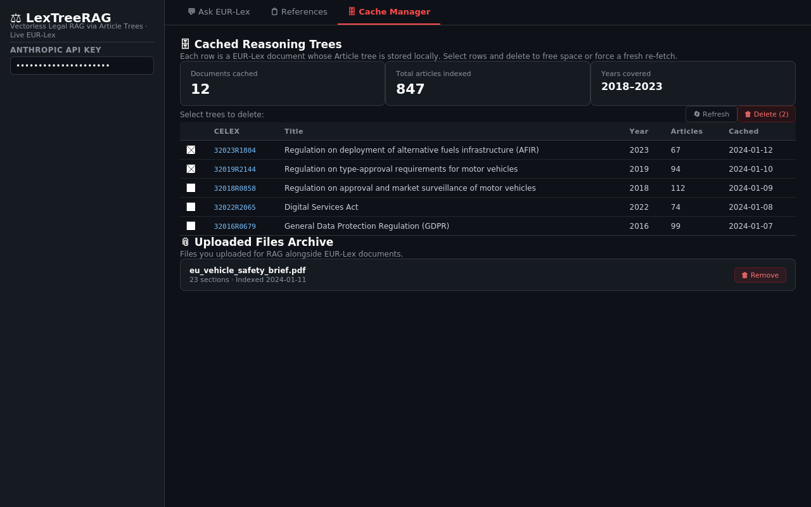

# Cache Manager

*Cache Manager tab — cached tree table, summary metrics, and uploaded files archive*

Browse and manage the three local data stores that prevent re-fetching EUR-Lex documents on every query.

**File:** `app.py` — `with tab_cache:`

---

## Cached Reasoning Trees

| Column | Source | Field | Calculation | Business meaning |
|---|---|---|---|---|
| **CELEX** | `data/cache/**/*.json` | `json["doc_id"]` | Raw string, truncated to 80 chars | EUR-Lex document identifier |
| **Title** | `data/cache/**/*.json` | `json["title"]` | Truncated to 70 chars | Full regulation or directive title |
| **Year** | `data/cache/**/*.json` | `json["year"]` | `str(year)` | 4-digit document year |
| **Articles** | `data/cache/**/*.json` | `len(json["nodes"])` | Count of node dicts in the array | Number of Article nodes in the reasoning tree |
| **Cached** | `data/cache/**/*.json` | `json["indexed_at"]` | ISO datetime truncated to date (`[:10]`) | Date this document was first indexed |

**Data path:** `list_cached_trees()` in `app.py` → `glob.glob("data/cache/**/*.json", recursive=True)` → reads each file.

**Delete:** select from multiselect → `delete_trees(selected_files)` → `os.remove(f)` per file → `st.rerun()`.

---

## Summary Metric Cards

| Metric | Calculation |
|---|---|
| Documents cached | `len(trees)` |
| Total articles indexed | `sum(t["Articles"] for t in trees)` |
| Years covered | `f"{min_year}–{max_year}"` from sorted unique years |

---

## Uploaded Files Archive

| Field | Source | Calculation | Meaning |
|---|---|---|---|
| **Title** | `data/cache/uploads/*.json` | `ut["title"]` | Original uploaded filename |
| **Sections** | `data/cache/uploads/*.json` | `len(ut["nodes"])` | Number of chunks the file was split into |
| **Indexed** | `data/cache/uploads/*.json` | `ut["indexed_at"][:10]` | Date the file was first processed |

**Data path:** `load_all_upload_trees(CACHE_DIR)` in `pipeline/doc_ingester.py` → lists `data/cache/uploads/*.json`.

---

## PDF Archive

| Column | Source | Calculation | Meaning |
|---|---|---|---|
| **CELEX** | Filename under `data/pdfs/` | Filename minus `.pdf` | EUR-Lex identifier (underscores may replace `/`) |
| **Year** | Directory name | `os.path.basename(root)` | Year folder the PDF is stored under |
| **Size KB** | `os.path.getsize(fpath)` | `round(size / 1024, 1)` | File size in kilobytes |
| **Path** | Full filesystem path | Absolute path | Where the PDF is stored on disk |

**Data path:** `list_archived()` in `pipeline/pdf_archive.py` → `os.walk("data/pdfs/")` → skips `inbox/`.

---

## PDF Inbox Auto-indexing

On app startup, if a client is authenticated:

1. `scan_inbox(CACHE_DIR, client)` — `pipeline/pdf_archive.py`
2. For each `.pdf` in `data/pdfs/inbox/`:
    - CELEX detected from filename via regex
    - If already cached → skip
    - Else → `build_tree()` → JSON saved → PDF moved to `data/pdfs/{year}/{celex}.pdf`
3. Count of newly indexed PDFs shown as sidebar success message
