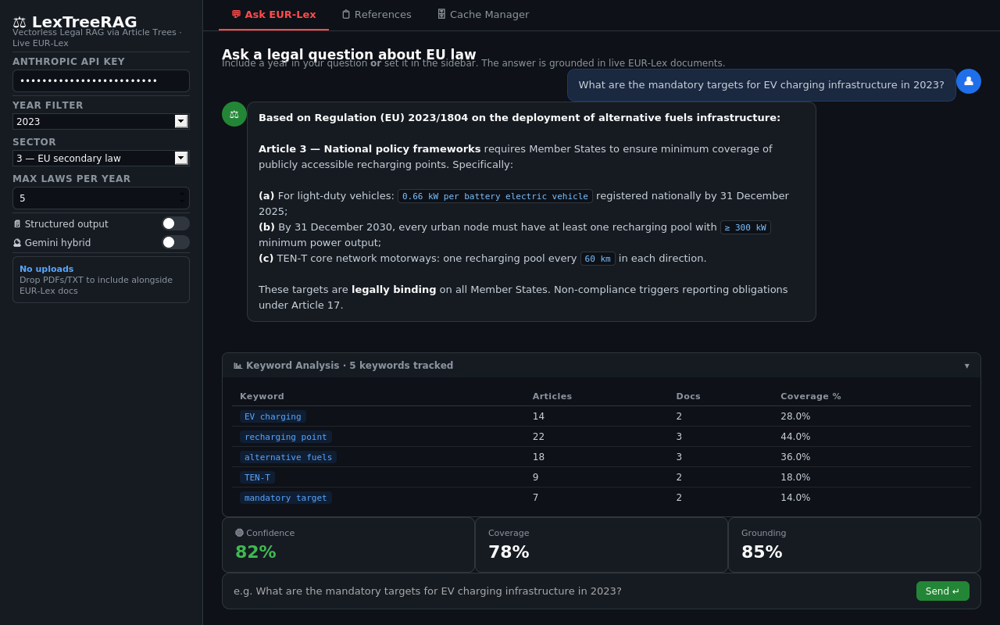

# Chat — Ask EUR-Lex


*Ask EUR-Lex tab — question input, streamed answer, keyword analysis table, and confidence metrics*


The main interface. Type a legal question, get a cited answer grounded in live EUR-Lex documents.

**File:** `app.py` — `with tab_ask:`

---

## Keyword Analysis Table

Shown after every query in an expandable panel. Rendered as a plain HTML table.

| Column | Source | Calculation | Business meaning |
|---|---|---|---|
| **Keyword** | `keyword_extractor.py` + regex | From `extract_keywords_and_year()` + `_extract_exact_signals()` | Search term used to find EU regulations |
| **Articles** | In-memory, `keyword_article_stats()` in `app.py` | Count of tree nodes whose `text + title + summary` contains the keyword (case-insensitive) | How many article nodes mention this keyword |
| **Docs** | In-memory, `keyword_article_stats()` | Count of distinct trees with at least one matching node | How many EUR-Lex documents mention this keyword |
| **Coverage %** | In-memory | `round(art_hits / total_nodes * 100, 1)` | Share of all retrieved articles that mention this keyword |

**Data path:** `st.session_state.kw_stats` ← `run_query()["kw_stats"]` ← `keyword_article_stats()` in `app.py`

---

## Confidence Metrics

Three `st.metric()` cards shown after every answer.

| Metric | Calculation | Meaning |
|---|---|---|
| **Confidence** | `round(0.4 × coverage + 0.6 × grounding)` | Overall answer quality 0–100. ≥75 high, 50–74 medium, <50 low |
| **Coverage** | Claude Haiku scores 0–100 | Do the retrieved articles cover all aspects of the question? |
| **Grounding** | Claude Haiku scores 0–100 | Are the answer's claims traceable to article text? |

---

## Full Query Pipeline

### 1. Question classification
`pipeline/query_classifier.py` → `classify_question()`

- Model: `claude-haiku-4-5`, max_tokens=300
- Returns: `definitional | compliance | comparison | timeline | complex | general`
- `complex` → decomposed into 2–4 sub-questions, each searched independently

### 2. Keyword extraction
`pipeline/keyword_extractor.py` → `extract_keywords_and_year()`

- Model: `claude-haiku-4-5`, max_tokens=256
- Returns keywords, year, exact regulation/article signals (regex), query variants
- Obligation expansion: if question contains `requir`, `document`, `mandatory`... → injects `["shall", "required", "obligation"]`

### 3. EUR-Lex SPARQL search
`pipeline/eurolex_client.py` → `search_eurlex()`

SPARQL endpoint: `https://publications.europa.eu/webapi/rdf/sparql`

Four-pass strategy:

| Pass | Strategy | Purpose |
|---|---|---|
| 0 | AND: domain term + topic term | Vehicle-specific regulations |
| 1 | OR: specific (low-noise) keywords | Main keyword match |
| 2 | OR: all keywords including noisy | Fallback |
| 3 | Drop sector filter | Last resort, widest coverage |

### 4. Document fetch
`pipeline/eurolex_client.py` → `fetch_documents_parallel(max_workers=3)`

Per document:

1. Check local PDF archive (`data/pdfs/{year}/{celex}.pdf`)
2. Resolve SPARQL expression slot number
3. Try PDF at discovered slot
4. Try PDF at default slot 0001
5. Try HTML → Markdown conversion

### 5. Reasoning tree build
`pipeline/tree_builder.py` → `build_tree()`

- Cache check: `data/cache/{year}/{celex}.json` → return immediately if found
- Parse articles with regex `_ART_HEADER` + `_ANNEX_HEADER`
- Articles > 5,000 chars → sub-chunked into ~3,000-char parts
- No Article headers → paragraph fallback chunking
- Claude Haiku generates 1-sentence summary per article (batches of 12)

### 6. Tree navigation
`pipeline/tree_navigator.py` → `navigate_tree()`

- Builds slim tree: only summaries + `[OBL]`/`[LIST]` badges, no full text
- Claude Haiku scores articles 0–10, discards < 4
- Parent node selected → all sub-nodes included automatically

### 7. Citation link following
`pipeline/eurolex_client.py` → `follow_citation_links()`

- Regex-extracts EU act citations from selected article texts
- Fetches up to 3 linked documents not already in tree set
- Re-navigates if new documents added

### 8. Python reranking
`pipeline/clause_ranker.py` → `rerank_nodes()`

```
final_score = base_relevance + min(obligation_score, 6) + min(list_score×2, 6) + penalty
```

- `obligation_score`: counts `shall`, `must`, `required to`, etc. on original text
- `list_score`: counts `(a)(b)(c)`, numbered items, table rows, dash lists
- `penalty = -4.0` if title is "scope/definitions/subject-matter" AND no obligation keywords

### 9. Answer generation
`app.py` → `answer_stream()` / `answer_structured()`

- Model: `claude-opus-4-6`, max_tokens=4096, `thinking: {"type": "adaptive"}`
- **Prose mode**: streaming, 8-rule system prompt (cite exact provisions, no speculation, self-check)
- **Structured mode**: returns JSON `{summary, obligations, rights, definitions, exceptions, procedure, references, caveats}`

### 10. Confidence scoring + retry
`pipeline/answer_verifier.py` → `compute_confidence()`

- Model: `claude-haiku-4-5`, max_tokens=400
- If score < 50 or coverage < 40 → up to 2 automatic retries:
    - **Attempt 2**: obligation-expanded keywords
    - **Attempt 3**: drop year filter, expand sectors, +3 max docs
- After 3 attempts still low → keyword discovery UI shown

---

## Session State Reference

| Key | Type | Description |
|---|---|---|
| `history` | `list[dict]` | Full conversation `[{role, content, references, meta}]` |
| `references` | `list[dict]` | Last answer's article references |
| `kw_stats` | `list[dict]` | Keyword analysis rows |
| `prev_selected_nodes` | `list[dict]` | Nodes from last answer (conversation memory) |
| `upload_trees` | `list[dict]` | Trees built from user-uploaded files |
| `structured_mode` | `bool` | JSON output vs. prose streaming |
