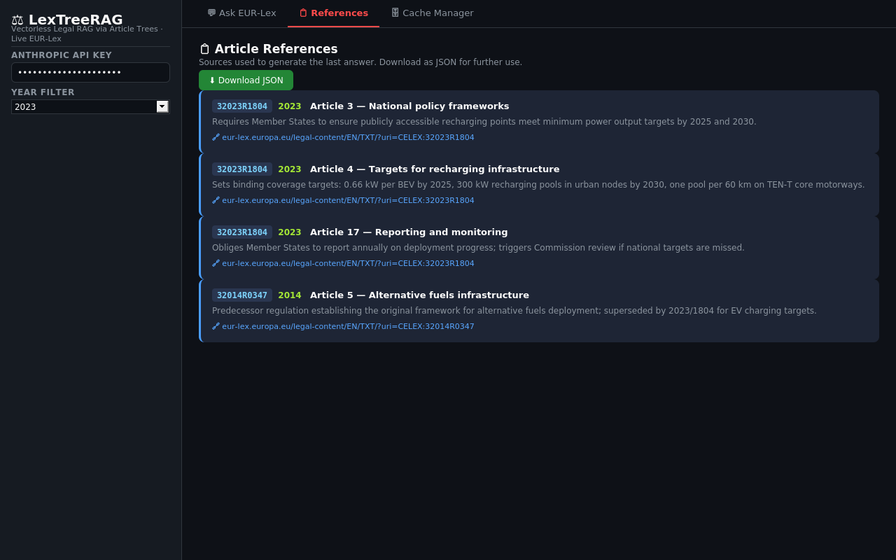

# References Tab


*References tab — article cards with CELEX identifier, year, summary, and EUR-Lex link*


Shows every EUR-Lex article used to produce the last answer. Each entry is a styled card with CELEX, year, article title, summary, and a direct EUR-Lex link.

**File:** `app.py` — `with tab_refs:`

---

## Reference Card Fields

| Field | Source file | Original field | Calculation | Business meaning |
|---|---|---|---|---|
| **CELEX** | `eurolex_client.py` SPARQL | `?celex` binding | Raw CELEX string from `doc_id` | Official EUR-Lex document ID (e.g. `32019R2144` = sector 3, year 2019, Regulation 2144) |
| **Year** | `tree_builder.py` | `tree["year"]` | `str(year)` or `"uploaded"` if year is 0 | Year the document was created in EUR-Lex |
| **Article** | `tree_builder.py` | `node["title"]` | `f"Article {title}"` | Article number and title as parsed from document Markdown |
| **Summary** | `tree_builder.py` via Claude Haiku | `node["summary"]` | First 120 chars of Haiku-generated summary | One-sentence description of what the article covers |
| **🔗 Open on EUR-Lex** | `eurolex_client.py` | `doc["url"]` | `https://eur-lex.europa.eu/legal-content/EN/TXT/?uri=CELEX:{celex}` | Direct link to the full document |

---

## Data Flow

```
run_query() — app.py
  └─ selected nodes (from navigate_tree + rerank_nodes)
       └─ each node → reference dict:
            {CELEX, Article, Summary, URL, Year}
                 │
                 └─ st.session_state.references
                          │
                          └─ rendered in tab_refs as HTML cards
```

**Download button:** `st.download_button()` serialises `references` as `json.dumps(refs, indent=2)`.
Filename: `eurolex_refs_{YYYYMMDD_HHMMSS}.json`

---

## Reference Dict Schema

```json
{
  "CELEX":   "32019R2144",
  "Article": "Article 4 — General obligations of manufacturers",
  "Summary": "Requires manufacturers to ensure vehicles comply with type-approval requirements.",
  "URL":     "https://eur-lex.europa.eu/legal-content/EN/TXT/?uri=CELEX:32019R2144",
  "Year":    "2019"
}
```
